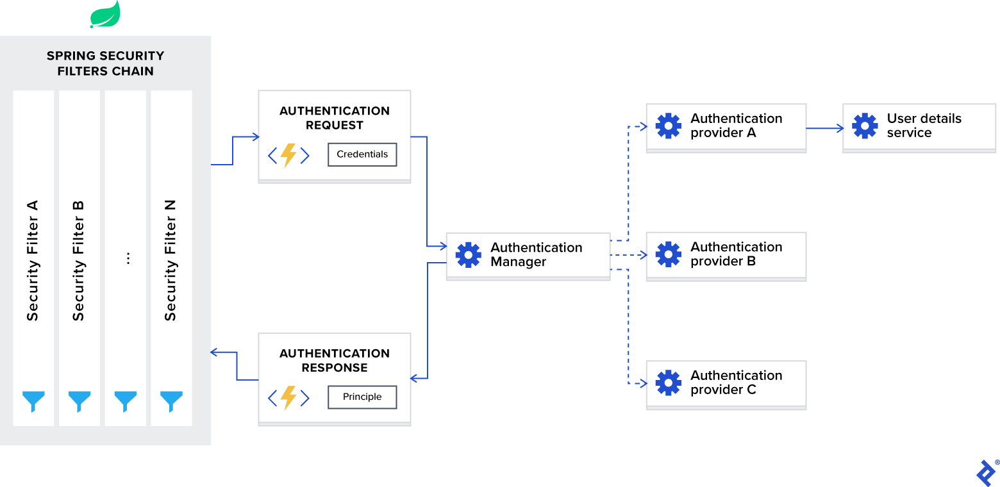

# Spring Security com *`JWT`* para *`API REST`*

O *Spring Security* é a estrutura de fato para proteger aplicativos *Spring*, mas pode ser conplicado de configurar.

Este artigo do *Spring Security* destaca uma solução `JWT` eficiente.

**Aviso: O *Spring Security 5+* lançou o suporte para `OAuth JWT`. Recomenda-se usar a versão mais recente do *OAuth* para suporte a `JWT` em vez de usar segurança ou filtros personalizados.**

O *Spring* é considerado um *framework confiável* no ecossistema *Java* e é amplamente utilizado. Não é mais válido se referir ao *Spring* como um framework, pois é mais um termo abrangente que abrange vários frameworks. Um desses frameworks é o *Spring Security*, um framework de autenticação e autorização poderoso e personalizável. Ele é considerado o padrão de fato para proteger aplicativos baseados em *Spring*. Portanto, se você deseja implemnetar uma *solução de token `JWT Spring`*, faz sentido baseá-lo no *Spring Security*.
Apesar de sua popularidade, devo admitir que, quando se trata de aplicativos de página única, o *Spring* não é simples e direto de configurar. Suspeito que o motivo seja que ele começou mais como um *framework orientado a aplicativos MVC*, onde a renderização de páginas da web ocorre no lado do servidor e a *comunicação é baseada em sessão*.

Se o `back-end` for baseado em *Java* e *Spring*, faz sentido usar o *Spring Security* com `JWT` para autenticação/autorização e configurá-lo para comunicação sem estado. Embora existam muitos artigos explicando como isso é feito, para mim, ainda foi frustante configurá-lo pela primeira vez, e tive que ler e somar informações de várias fontes. É por isso que decedi escrever este tutorial do *Spring Security*, onde tentarei resumir e abordar todos os detalhes sutis e pontos fracos que você pode encontrar durante o processo de configuração.

## Definindo Terminologia

Antes de mergulhar nos detalhes técnicos, quero definir explicitamente a terminologia usada no contexto do *Spring Security* apenas para ter certeza de que todos falamos a mesma língua.

Estes são os termos que precisamos abordar:

- **Authentication *(Autenticação)*** refere-se ao processo de verificação da identidade de um usuário, com base nas credenciais fornecidas. Um exemplo comum é inserir um nome de usuário e uma senha ao fazer login em um site. Você pode pensar nisso como uma resposta à pergunta *"QUem é você?"*.
- **Authorization *(Autorização)*** refere-se ao processo de determinar se um usuário tem permissão adequada para executar uma ação específica ou ler dados específicos, supondo que o usuário seja autenticado com sucesso. Você pode pensar nisso como uma resposta à pergunta *"Um usuário pode fazer/ler isto?"*.
- **Principle *(Princípio)*** refere-se ao usuário atualmente autenticado.
- **Granted authority *(Autoridade concedida)*** refere-se à permissão do usuário autenticado.
- **Role *(Função)*** refere-se a um grupo de permissões do usuário autenticado.

## Criando um aplicativo Spring Básico

Antes de passar para a configuração do framework *Spring Security*, vamos criar uma aplicação web *Spring* báscia. Para isso, podemos usar um [Spring Initializr](https://start.spring.io/) e gerar um projeto modelo. Para uma aplicação web simples, apenas uma dependência do framework web *Spring* é suficiente:

```xml
<dependencies>
    <dependency>
        <groupId>org.springframework.boot</groupId>
        <artifactId>spring-boot-starter-web</artifactId>
    </dependency>
</dependencies>
```

Depois de criar o projeto, podemos adicionar um `controller` *REST* simples a ele da seguinte maneira:

```java
@RestController @RequestMapping("hello")
public class HelloRestController {
    @GetMapping("user")
    public String helloUser() {
        return "Hello User";
    }

    @GetMapping("admin")
    public String helloAdmin() {
        return "Hello Admin";
    }
}
```

Depois disso, se construirmos e executarmos o projeto, poderemos acessar as seguintes `URLs` no navegador:

- `http://localhost:8080/hello/user` retornará `Hello User`.
- `http://localhost:8080/hello/admin` retornará `Hello Admin`.

Agora, podemos adicionar o framework *Spring Security* ao nosso projeto, e podemos fazer isso adicionando a seguinte dependência ao nosso arquivo `pom.xml`:

```xml
<dependencies>
    <dependency>
        <groupId>org.springframework.boot</groupId>
        <artifactId>spring-boot-starter-security</artifactId>
    </dependency>
</dependencies>
```

Adicionar routras dependências do framework *Spring* normalmente não tem efeito imediato em um aplicativo até que fornecamos a configuração correspondente, mas o *Spring Security* é diferente, pois tem *efeito imediato*, o que geralmente confunde novos usuários. Após adicioná-lo, se reconstruirmos e executarmos o projeto e, em seguida, tentarmos acessar uma das `URLs` mencionadas em vez de visualizar o resultado, seremos redirecionados para `http://localhost:8080/login`. Este é o comportamento padrão, pois o framework *Spring Security* exige autenticação pronta para uso em todas `URLs`.

Para passar a autenticação, podemos usar o nome de usuário padrão `user` e encontrar uma senha gerada automaticamente em nosso console:

```
Using generated security password: 1fc15145-dfee-4bec-a009-e32ca21c77ce
```

Lembre-se de que a senha muda sempre que executamos o aplicativo novamente. Se quisermos alterar esse comportamento e tornar a senha estática, podemos adicionar a seguinte configuração ao nosso arquivo `application.properties`:

```
spring.security.user.password=Test12345_
```

Agora, se inserirmos as credenciais no formulário de login, seremos redirecionados para nossa `URL` e veremos o resultado correto. Observe que o processo de autenticação padrão é baseado em sessão e, se quisermos sair, podemos acessar a seguinte `URL`: `http://localhost:8080/logout`.

Esse comportamento pronto para uso pode ser útil para *aplicações web MVC clássicas*, nas quais temos *autenticação baseada em sessão*, mas, no caso de aplicações de página única, geralmente não é útil, pois, na maioria dos casos de uso, temos renderização do lado do cliente e *autenticação sem estado baseada em `JWT`*. Nesse caso, teremos que personalizar bastante o framework *Spring Security*, o que faremos no restante do artigo.

Com exemplo, implementaremos um aplicativo web de livrária clássico e criaremos um `back-end` que fornecerá `APIs CRUD` para criar autores e livros, além de `APIs` para gerenciamento e autenticação de usuários.

## Visão Geral da Arquitetura do *Spring Security*

Antes de começarmos a personalizar a configuração, vamos primeiro discutir como a autenticação do *Spring Security* funciona nos bastidores.

*O driagrama a seguir apresenta o fluxo e mostra como as solicitações de autenticação são processadas:*

### Arquitetura do *Spring Security*



Agora, vamos dividir este diagrama em componentes e discutir cada um deles separadamente.

### Filtros do *Spring Security*

Ao adicionar o framework *Spring Security* ao seu aplicativo, ele registra automaticamente uma *cadeia de filtros* *(filters chain)* que intercepta todas as aplicações recebidas. Essa cadeia consiste em vários filtros, e cada um deles lida com um caso de uso específico.

Por exemplo:

- Verifique se a `URL` solicitada é acessível publicamente, com base na configuração.
- Em caso de *autenticação baseada em sessão*, verifique se o usuário já está autenticado na sessão atual.
- Verifique se o usuário está autorizado a executar a ação solicitada e assim por diante.

*Um detalhe importante que quero mencionar é que os filtros do **Spring Security** são registrados com a ordem mais baixa e são os primeiros a serem invocados. Em alguns casos de uso, se você quiser colocar seu filtro personalizado na frente deles, precisará adicionar preenchimento à ordem. Isso pode ser feito com a seguinte configuração:*

```
spring.security.filter.order=10
```

Depois de adicionarmos essa configuração ao nosso arquivo `application.properties`, teremos espaço para 10 fultros personalizados na frente dos filtros do *Spring Security*.

### `AuthenticationManager`

Você pode pensar em `AuthenticationManager` *(Gerenciador de Autenticação)* como um coordenador onde é possível registrar vários provedores e, com base no tipo de solicitação, ele entregará uma solicitação de autenticação ao provedor correto.

### `AuthenticationProvider`

`AuthenticationProvider` *(Provedor de Autenticação)* processa tipos específicos de autenticação. Sua interface expõe apenas duas funções:

- `authenticate` realiza autenticação com a solicitação.
- `supports` verifica se este provedor suporta o tipo de autenticação indicado.

Uma implementação importante da interfacce que estamos usando em nosso projeto de exemplo é `DaoAuthenticationProvider`, que recupera detalhes do usuário de um `UserDetailsfService`.

### `UserDetailsService`

`UserDetailsService` é descrito como uma interface central que carrega dados específicos do usuário na documentação do *Spring*.

Na maioria dos casos de uso, os provedores de autenticação extraem informações de identidade do usuário com base em *credencias de um banco de dados* e, em seguida, realizam a validação. Como esse caso de uso é tão comum, os desenvolvedores do *Spring* decidiram *extraí-lo* como uma *interface* separada, que expõe a função única:

- `loadUserByUsername` aceita nome de usuário como parâmetro e retorna o objeto de identidade do usuário.

## Autenticação Usando `JWT` com *Spring Security*

Depois de discutir os aspectos internos do framework *Spring Security*, vamos configurá-lo para *autenticação sem estado* com um *token `JWT`*.

Para personalizar o *Spring Security* para uso com `JWT`, precisamos de uma classe de configuração anotada com a anotação `@EnableWebSecurity` em nosso `classpath`. Além disso, para simplificar o processo de personalização, o framework expõe uma classe `WebSecurityConfigurerAdapter`. Estenderemos esse adaptador e substituiremos ambas as funções para:

1. Configurar o gerenciador de autenticação com o provedor correto.
2. Configurar a segurança da web *(URLs públicas, URLs privadas, autorização, etc.)*.

```java
@EnableWebSecurity
public class SecurityConfig extends WebSecurityConfigurerAdapter {
    @Override
    protected void configure(AuthenticationManagerBuilder auth) throws Exception {
        // TODO configure authentication manager
    }

    @Override
    protected void configure(HttpSecurity http) throws Exception {
        // TODO configure web security
    }
}
```

Em nosso aplicativo de exemplo, armazenamos identidades de usuários em um banco de dados `MongoDB`, na coleção `users`. Essas identidades são mapeadas pela entidade `User` e suas operações `CRUD` são definidas pelo repositório `UserRepo` do *Spring Data*.

Agora, quando aceitarmos a solicitação de autenticação, precisamos recuperar a identidade correta do banco de dados usando as credencias fornecidas e, em seguida, verificá-la. Para isso, precisamos da implementação da interface `UserDetailsService`, que é definida da seguinte forma:

```java
public interface UserDetailsService {
    UserDetails loadUserByUsername(String username) throws UsernameNotFoundException;
}
```

Aqui, podemos ver que é necessário retornar o objeto que implementa a inteface a `UserDetails`, e nossa entidade `User` o implementa *(para detalhes de implemnetação, consulte o repositório do projeto de exemplo)*. Considerando que ele expõe apenas o protótipo de função única, podemos tratá-lo como uma interface funcional e fornecer a implementação com uma expressão `lambda`.

```java
@EnableWebSecurity
public class SecurityConfig extends WebSecurityConfigurerAdapter {
    private final UserRepo userRepo;

    public SecurityCOnfig(UserRepo userRepo) {
        this.userRepo = userRepo;
    }

    @Override
    protected void configure(AuthenticationManagerBuilder auth) throws Exception {
        auth.userDetailsService(username -> userRepo
            .findByUsername(username)
            .orElseThrow(
                () -> new UsernameNotFoundException(
                    format("User: %s, not found", username)
                )
            ));
    }

    // Details omitted for brevity
}
```

Aqui, a chamada de função `auth.userDetailsService` inciará a instância a `DaoAuthenticationProvider` usando nossa implementação da interface `UserDetailsService` e a registrará no gerenciador de autenticação.

Juntamente com o provedor de autenticação, precisamos configurar um gerenciador de autenticação com o esquema de codificação de senha correto que será usado para verificação de credenciais. Para isso, precisamos expor a implementação preferencial da interface `PasswordEncoder` como um `bean`.

Em nosso projeto de exemplo, usaremos o algoritmo de *hash de senha* `bcrypt`.

```java
@EnableWebSecurity
public class SecurityConfig extends WebSecurityConfigurerAdapter {
    private final UserRepo userRepo;

    public SecurityConfig(UserRepo userRepo) {
        this.userRepo = userRepo;
    }

    @Override
    protected void configure(AuthenticationManagerBuilder auth) throws Exception {
        auth.userDetailsService(username -> userRepo
        (
            .findByUsername(username)
            .orElseThrow(
                () -> new UsernameNotFoundException(
                    format("User: %s, not found", username)
                )
            )
        ));
    }

    @Bean
    public PasswordEncoder passwordEncoder() {
        return new BCryptPasswordEncoder();
    }

    // Details omitted for brevity
}
```

Após configurar o gerenciador de autenticação, precisamos agora configurar a segurança web. Estamos implementando uma `API REST` e precisamos de autenticação sem estado com um *token `JWT`*; portanto, precisamos definir as seguintes opções:

- Habilite `CORS` e desabilite `CSRF`.
- Defina o gerenciamento de sessão como *sem estado*.
- Defina o manipulador de exceções para solicitações não autorizadas.
- Defina permissões em `endpoints`.
- Adicionar filtro de *token `JWT`*

Esta configuração é implementada da seguinte maneira:

```java
@EnableWebSecurity
public class SecurityConfig extends WebSecurityConfigurerAdapter {
    private final UserRepo userRepo;
    private final JwtTokenFilter jwtTokenFilter;

    public SecurityConfig(UserRepo userRepo, JwtTokenFilter jwtTokenFilter) {
        this.userRepo = userRepo;
        this.jwtTokenFilter = jwtTokenFilter;
    }

    // Details omitted for brevity

    @Override
    protected void configure(HttpSecurity http) throws Exception {
        // Enable CORS and disable CSRF
        http = http.cors().and().csrf().disable();

        // Set session management to stateless
        http = http
            .sessionManagement()
            .sessionCreationPolicy(SessionCreationPolicy.STATELESS)
            .and();

        // Set unauthorized requests exception handler
        http = http
            .exceptionHandling()
            .authenticationEntryPoint(
                (request, response, ex) -> {
                    response.sendError(
                        HttpServletResponse.SC_UNAUTHORIZED,
                        ex.getMessage()
                    );
                }
            )
            .and();

            // Set permission on endpoints
            http.authorizeRequests()
                // Our public endpoints
                .antMatchers("/api/public/**").permitAll()
                .antMatchers(HttpMethod.GET, "/api/author/**").permitAll()
                .antMatchers(HttpMethod.POST, "/api/author/search").permitAll()
                .antMatchers(HttpMethod.GET, "/api/book/**").permitAll()
                // Our private endpoints
                .anyRequest().authenticated();

            // Add JWT token filter
            http.addFilterBefore(
                jwtTokenFilter,
                UsernamePasswordAuthenticationFilter.class
            );
    }

    // Used by Spring Security if CORS is enabled.
    @Bean
    public CorsFilter corsFilter() {
        UrlBasedCorsConfigurationSource source =
            new UrlBasedCorsConfigurationSource();

        CorsConfiguration config = new CorsConfiguration();
        
        config.setAllowCredentials(true);
        config.addAllowedOrigin("*");
        config.addAllowedHeader("*");
        config.addAllowedMethod("*");

        source.registerCorsConfiguration("/**", config);

        return new CorsFilter(source);
    }
}
```

Observe que adicionamos o `JwtTokenFilter` antes do `UsernamePasswordAuthenticationFilter` interno do *Spring Security*. Estamos fazendo isso porque precisamos acessar a identidade do usuário neste momento para realizar a autenticação/autorização, e sua extração ocorre dentro do filtro de *token `JWT`* com base no *token `JWT`* fornecido. Isso é implementado da seguinte maneira:

```java
@Component
public class JwtTokenFilter extends OncePerRequestFilter {
    private final JwtTOkenUtil jwtTokenUtil;
    private final UserRepo userRepo;

    public JwtTokenFilter(JwtTokenUtil jwtTokenUtil, UserRepo userRepo) {
        this.jwtTokenUtil = jwtTokenUtil;
        this.userRepo = userRepo;
    }

    @Override
    protected void doFilterInternal(HttpServletRequest request, HttpServletResponse response, FilterChain chain) throws ServletException, IOException {
        // Get authorization header and validate
        final String header = request.getHeader(HttpHeaders.AUTHORIZATION);

        if (isEmpty(header) || !header.startsWith("Bearer ")) {
            chain.doFilter(request, response);

            return;
        }

        // Get JWT token and validate
        final String token = header.split(" ")[1].trim();

        if (!jwtTokenUtil.validate(token)) {
            chain.doFilter(request, response);

            return;
        }

        // Get user identity and set it on the sprint security context
        UserDetails userDetaiuls = userRepo
            .findBtUsername(jwtTokenUtil.getUsername(token))
            .orElse(null);

        UsernamePasswordAuthenticationToken
            authentication = new UsernamePasswordAuthenticationToken(
                userDetails, null,
                userDetails == null ?
                    List.of() : userDetails.getAuthorities()
            );

        authentication.setDetails(
            new WebAuthenticationDetailsSource().bindDetails(request)
        );

        SecurityContextHolder.getContext().setAuthentication(authentication);
        chain.doFilter(request, response);
    }
}
```

Antes de implementar nossa função de *`API` de login*, precisamos cuidar de mais uma etapa: precisamos acessar o gerenciador de autenticação. Por padrão, ele *não é acessível publicamente*, e precisamos *expô-lo explicitamente* como um `bean` em nossa classe de configuração.

Isso pode ser feito da seguinte forma:

```java
@EnableWebSecurity
public class SecurityConfig extends WebSecurityConfigurerAdapter {
    // Details omitted for brevity
    @Override @Bean
    public AuthenticationManager authenticationManagerBean() throws Exception {
        return super.authenticationManagerBean();
    }
}
```

E agora, estamos prontos para implementar nossa *função de login na `API`*:

```java
@Api(tags = "Authentication")
@RestController @RequestMapping(path = "api/public")
public class AuthApi {
    private final AuthenticationManager authenticationManager;
    private final JwtTokenUtil jwtTokenUtil;
    private final UserViewMapper userViewMapper;

    public AuthApi(AuthenticationManger authenticationManager, JwtTokenUtil jwtTokenUtil, UserViewMapper userViewMapper) {
        this.authenticationManager = authenticationManager;
        this.jwtTokenUtil = jwtTokenUtil;
        this.userViewMapper = userViewMapper;
    }

    @PostMapping("login")
    public ResponseEntity<UserView> login(@RequestBody @Valid AuthRequest request) {
        try {
            Authentication authenticate = authenticationManager
                .authenticate(
                    new UsernamePasswordAuthenticationToken(
                        request.getUsername(), request.getPassword()
                    )
                );

            User user = (User) authenticate.getPrincipal();

            return ResponseEntity.ok()
                .header(
                    HttpHeaders.AUTHORIZATION,
                    jwtTokenUtil.generateAccessToken(user)
                )
                .body(userViewMapper.toUserView(user));
        } catch (BadCredentialsException ex) {
            return ResponseEntity.status(HttpStatus.UNAUTHORIZED).build();
        }
    }
}
```

Aqui verificamos as credenciais fornecidas usando o gerenciador de autenticação e, em caso de sucesso, geramos o *token `JWT`* e o retornamos com um cabeçalho `HTTP` de resposta junto com as informações de identidade do usuário no corpo da resposta.

## Autorização `JWT` com *Spring Security*

Na seção anterior, configuramos um processo de autenticação *Spring `JWT`* e configuramos `URLs` públicas/privadas. Isso pode ser suficiente para aplicações simples, mas para a maioria dos casos de uso reais, sempre precisamos de políticas de acesso baseadas em funções para nossos usuários. Neste capítulo, abordaremos essa questão e configuraremos um esquema de autorização baseado em funções usando o framework *Spring Security*.

Em nosso aplicativo de exemplo, definimos as três funções a seguir:

- `USER_ADMIN` nos permite gerenciar usuários do aplicativo.
- `AUTHOR_ADMIN` nos permite gerenciar autores.
- `BOOK_ADMIN` nos permite gerenciar livros.

Agora, precisamos aplicá-los às `URLs` correspondentes:

- `api/public` é acessível publicamente.
- `api/admin/user` usuários com a função `USER_ADMIN` podem acessar.
- `api/author` usuários com a função `AUTHOR_ADMIN` podem acessar.
- `api/book` usuários com a função `BOOK_ADMIN` podem acessar.

O framework *Spring Security* nos fornece duas opções para configurar o esquema de autorização:

- Configuração baseada em `URL`.
- Configuração baseada em anotação.

Primeiro, vamos ver como funciona a configuração baseada em `URL`. Ela pode ser aplicada à configuração de segurança da web da seguinte forma:

```java
@EnableWebSecurity
public class SecurityConfig extends WebSecurityConfigurerAdapater {
    // Details omitted for brevety
    
    @Override
    protected void configure(HttpSecurity http) throws Exception {
        // Enable CORS and disable CSRF
        http = http.cors().and().csrf().disable()

        // Set session management to stateless
        http = http
            .sessionManagement()
            .sessionCreationPolicy(SessionCreationPolicy.SATELESS)
            .and();

        // Set unauthorized request exception handler
        http = http
            .exceptionHandling()
            .authenticationEntryPoint(
                (request, response, ex) -> {
                    response.sendError(
                        HttpServletResponse.SC_UNAUTHORIZED,
                        ex.getMessage()
                    );
                }
            )
            .and();

        // Set permission on endpoints
        http.authorizeRequests()
            // Our public endpoints
            .antMatchers("api/public/**").permitAll()
            .antMatchers(HttpMethod.GET, "/api/author/**").permitAll()
            .antMatchers(HttpMethod.POST, "/api/author/search").permitAll()
            .antMatchers(HttpMethod.GET, "/api/book/**").permitAll()
            .antMatchers(HttpMethod.POST, "/api/book/search").permitAll()
            // Our private endpints
            .antMatchers("/api/admin/user/**").hasRole(Role.USER_ADMIN)
            .antMatchers("/api/author/**").hasRole(Role.AUTHOR_ADMIN)
            .antMatchers("/api/book/**").hasRole(Role.BOOK_ADMIN)
            .anyRequest().authenticated();
        
        // Add JWT token filter
        http.addFilterBefore(
            jwtTokenFilter,
            UsernamePasswordAuthenticationFilter.class
        );
    }

    // Details omitted for brevity
}
```

Como você pode ver, essa abordagem é simples e direta, mas tem uma desvantagem. O esquema de autorização em nossa aplicação pode ser complexo e, se definirmos todas as regras em um único lugar, ele se tornará muito grande, complexo e difícil de ler. Por isso, geralmente prefiro usar a configuração baseada em anotações.

O framework *Spring Security* define as seguintes anotações para segurança web.

- `@PreAuthorize` suporta *[Spring Expression Language](https://www.baeldung.com/spring-expression-language)* e é usado para fornecer controle de acesso baseado em expressão *antes de executar* o método.
- `@PostAuthorize` suporta *[Spring Expression Language](https://www.baeldung.com/spring-expression-language)* e é usado para fornecer o controle de acesso baseado em expressão *após a execução do método* *(fornece a capacidade de acessar o resultado do método)*.
- `@PreFilter` suporta [Spring Expression Language](https://www.baeldung.com/spring-expression-language) e é usado para fltrar a coleção ou matrizes *antes de executar o método* com base em regras de segurança personalizadas que definimos.
- `POstFilter` suporta [Spring Expression Language](https://www.baeldung.com/spring-expression-language) e é usado para filtrar a coleção ou matrizes retornados *após executar o método* com base em regras de segurança personalizadas que definimos *(fornecemos a capacidade de acessar o resultado do método)*.
- `@Secured` não suporta [Spring Expression Language](https://www.baeldung.com/spring-expression-language) e é usado para especificar uma lista de funções em um método.
- `@RolesAllowed` não oforece suporta à [Spring Expression Language](https://www.baeldung.com/spring-expression-language) e é a anotação equivamente de `@Secured` do [**JSR 250**](https://en.wikipedia.org/wiki/JSR_250).

Essas anotações são desabilitadas por padrão e podem ser habilitadas em nosso aplicativo da seguinte forma:

```java
@EnableWebSecurity
@EnableGlobalMethodSecurity(
    securedEnabled = true,
    jsr250Enabled = true,
    prePostEnabled = true
)
public class SecurityConfig extends WebSecurityConfigurerAdapter {
    // Details omitted for brevity
}
```

- `securedEnabled = true` habilita a anotação `@Secured`.
- `jsr250Enabled = true` habilita a anotação `@RolesAllowed`.
- `prePostEnabled = true` habilita anotações `@PreAuthorize`, `@PostAuthorize`, `@PreFilter`, `@PostFilter`.

Depois de habilitá-los, podemos aplicar políticas de acesso baseados em funções em nossos `endpoints` de `API` como esta:

```java
@Api(tags = "UserAdmin")
@RestController @RequestMapping(path = "api/admin/user")
@RolesAllowed(Role.USER_ADMIN)
public class UserAdminApi {
    // Details omitted for brevity
}

@Api(tags = "Author")
@RestController @RequestMapping(path = "api/author")
public class AuthorApi {
    // Details omitted for brevity

    @RolesAllowed(Role.AUTHOR_ADMIN)
    @PostMapping
    public void create() {}

    @RolesAllowed(Role.AUTHOR_ADMIN)
    @PutMapping("{id}")
    public void edit() {}

    @RolesAllowed(Role.AUTHOR_ADMIN)
    @DeleteMapping("{id}")
    public void delete() {}

    @GetMapping("{id}")
    public void get() {}

    @GetMapping("{id}/book")
    public void getBooks() {}

    @PostMapping("search")
    public void search() {}
}

@Api(tags = "Book")
@RestController @RequestMapping(path = "api/book")
public class BookAapi {
    // Details omitted for brevity
    @RolesAllowed(Role.BOOK_ADMIN)
    @PostMapping
    public BookView create() {}

    @RolesAllowed(Role.BOOK_ADMIN)
    @PutMapping("{id}")
    public void edit() {}

    @RolesAllowed(Role.BOOK_ADMIN)
    @DeleteMapping("{id}")
    public void delete() {}

    @GetMapping("{id}")
    public void get() {}

    @GetMapping("{id}/author")
    public void getAuthors() {}

    @PostMapping("search")
    public void search() {}
}
```

*Observe que as anotações de segurança podem ser fornecidas tanto no nível de classe quanto no nível do método.*

Os exemplo demonstrados são simples e nãpop representam cenários do mundo real, mas o *Spring Security* fornece um rico conjunto de anotações, e você pode manipular um esquema de autorização complexo se optar por usá-las.

### Nome da Função com Prefixo Padrão

Nesta subseção separada, quero enfatizar mais um detalhe sutil que confunde muitos usuários novos.

O framework *Spring Security* diferencia dois termos:

- *`Authority` representa uma permissão individual.*
- *`Role` representa um grupo de permissões.*

Ambos podem ser representados com uma única interface chamada `GrantedAuthority` e posteriormente verificada com *Spring Expression Language* dentro das anotações do *Spring Security*, da seguinte forma:

- `Authority`: `@PreAuthorize("hasAuthority('EDIT_BOOK')")`.
- `Role`: `@PreAuthorize("hasRole('BOOK_ADMIN')")`.

Para tornar a diferença entre esses dois termos mais explícita, o framework *Spring Security* adiciona um prefixo `ROLE_` ao *nome da função padrão*. Assim, em vez de verificar se há uma função chamada `BOOK_ADMIN`, ele verificará se há `ROLE_BOOK_ADMIN`.

Pessoalmente, acho esse comportamento confuso e prefiro desabilitá-lo em meus aplicativos. Ele pode ser desabilitado na configuração do *Spring Security* da seguinte forma:

```java
@EnableWebSecurity
public class SecurityConfig extends WebSecurityConfigurerAdapater {
    // Details omitted for brevity

    @Bean
    GrantedAuthorityDefaults grantedAuthorityDefaults() {
        return new GrantedAuthorityDefaults(""); // Romove the ROLE_ prefix
    }
}
```

## Testando nossa Solução *Spring Security* `JWT`

Para testar nossos `endpoints` com *testes unitários* ou de *integração* ao usar o framework *Spring Security*, precisamos adicionar `spring-security-test` a depndência junto com o `spring-boot-starter-test`. Nosso arquivo de build `pom.xml` ficará assim:

```xml
<dependency>
    <groupId>org.springframework.boot</groupId>
    <artifactId>spring-boot-starter-test</artifactId>
    <scope>test</scope>
    <exclusions>
        <exclusion>
            <groupId>org.junit.vintage</groupId>
            <artifactId>junit-vintage-engine</artifactId>
        </exclusion>
    </exclusions>
</dependency>

<dependency>
    <groupId>org.springframework.security</groupId>
    <artifactId>spring-security-test</artifactId>
    <scope>test</scope>
</dependency>
```

Essa dependência nos dá acesso a algumas anotações que podem ser usadas para adicionar contexto de segurança às nossas funções de teste.

Essas anotações são:

- `@WithMockUser` pode ser adicionado a um método de teste para emular a execução com um usuário simulado.
- `@WithUserDetails` pode ser adicionado a um método de teste para emular a execução com `UserDetails` retornado do `UserDetailsService`.
- `@WithAnonymousUser` pode ser adicionado a um método de teste para emular a execução com um usuário anônimo. Isso é útil quando um usuário deseja executar a maioria dos testes como um usuário específico e substituir alguns métodos para que sejam anônimos.
- `@WithSecurityContext` determina qual `SecurityContext` usar, e todas as três anotações descritas acima são baseadas nela. Se tivermos um caso de uso específico, podemos criar nossa própria anotação que usa `@WithSecurityContext` para criar qualquer `SecurityContext` que desejarmos. A discussão sobre isso está fora do escopo do nosso artigo do *Spring Security*, e consulte a documentação do *Spring Security* para mais detalhes.

A maneira mais fácil de executar os testes com um usuário específico é usar a anotação `@WithMockUser`. Podemos criar um usuário fictício com ela e executar o teste da seguinte maneira:

```java
@Test @WithMockUser(username="customUsername@example.io", roles={"USER_ADMIN"})
public void test() {
    // Details omitted for brevity
}
```

Essa abordagem tem algumas desvantagens. Primeiro, o usuário simulado não existe e, se você executar o teste de integração, que posteriormente consulta as informações do usuário no banco de dados, o teste falhará. Segundo, o usuário simulado é a instância da classe `org.springframework.security.core.userdetails.User`, que é a implementação interna da interface `UserDetails` no framework *Spring*, e se tivermos nossa própria implemnetação, isso pode causar conflitos posteriormente, *durante a execução do teste*.

Se as desvantagens anteriores forem um obstáculo para nossa aplicação, a anotação `@WithUserDetails` é a solução. Ela é usada quando temos implementações personalizadas de `UserDetails` e `UserDetailsService`. Ela pressupõe que o usuário existe, então precisamos criar a linha real no banco de dados ou fornecer a instância simulada de `UserDetailsService` antes de executar os testes.

É assim que podemos usar esta anotação:

```java
@Test @WithUserDetails("customUsername@example.io")
public void test() {
    // Details omitted for brevity
}
```

Esta é uma anotação preferencial nos testes de integração do nosso projeto de exemplo, porque temos implementações personalizadas das interfaces mencionadas acima.

O uso de `@WithAnonymousUser` permite a execução como um usuário anônimo. Isso é especialmente conveniente quando você deseja executar a maioria dos testes com um usuário específico, mas alguns testes como um usuário anônimo. POr exemplo, o seguinte teste executará os casos de teste `test1` e `test2` com um usuário simulado e `test3` com um usuário anônimo.

```java
@SpringBootTest
@AutoConfigureMockMvc
@WithMockUser
public class WithUserClassLevelAuthenticationTests {
    @Test
    public void test1() {
        // Details omitted for brevity
    }

    @Test
    public void test2() {
        // Details omitted for brevity
    }

    @Test @WithAnonymousUser
    public void test3() throws Exception {
        // Details omitted for brevity
    }
}
```

## Conquistanto a Curva de Aprendizado do *Spring Security `JWT`*

Por fim, gostaria de mencionar que o framework *Spring Security* provavelmente não vencera nenhum concurso de beleza e, definitivamente, tem uma curva de aprendizado íngreme. Já me deparei com muitas situações em que ele foi substituído por alguma solução interna devido à sua complexidade de configuração inicial. Mas, depois que os desenvolvedores entendem seus detalhes internos e conseguem definir a configuração inicial, ele se torna relativamente simples de usar.

## Fonte:

- Autor: [Ioram Gordadze](https://www.toptal.com/resume/ioram-gordadze)
- Artigo: [Spring Security JWT Tutorial](https://www.toptal.com/spring/spring-security-tutorial)